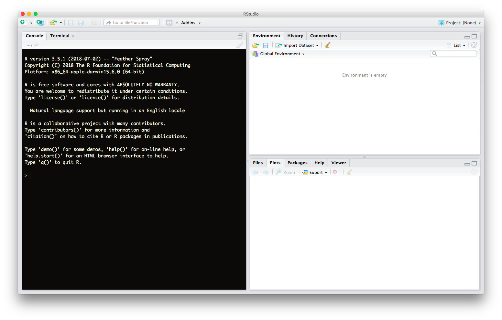

---
output:
  beamer_presentation:
    theme: Berlin
    colortheme: seagull
    fonttheme: professionalfonts
    highlight: tango
    toc: false
    includes:
      in_header: preamble.tex
---
```{r setup, include=FALSE}
knitr::opts_chunk$set(echo = TRUE)
```

\maketitle

## Outline
\tableofcontents

# General Information

## Who am I?

- **Background**: Political Scientist
- **Position**: Research Fellow, Chair of Comparative Politics, UP
- **Fields**: Autocracy, Contentious Politics, and Applied Methods
- **Secret weakness**: Zero intuition for maths & statistics
\vfill
\begin{block}{\textbf{Introductory Round}}
  So, who are you? Mind to fill us in on your secret weakness?
\end{block}
    
## Goals of this workshop

1. Provide a grand tour of elementary $\mathcal{R}$
    - Basic (probabilistic) programming
    - Elementary data management
    - Introduction to ggplot2
    - Applied regression & working with regression results
2. Introduce self-help strategies
    - Diagnose error messages
    - Find *relevant* resources
    - Ask a good question
3. Promote interest, because  $\mathcal{R} \approx$ Fun

## Workshop logistics

- **Place**: Campus Griebnitzsee, House 7, Room 144
- **Coffee break**: 10:45 - 11:00
- **Lunch break**: 12:30 - 13:30
- **Materials**: Go to https://github.com/dagtann/pcqr/

\begin{table}
\begin{tabular}{lccll}
\toprule
Day & Start & End & Official Topic\\
\midrule
1 & 09:15 & 10:45 & Introduction\\
~ & 11:00 & 12:30 & Data management\\
~ & 13:30 & 15:00 & Basic programming\\
\midrule
2 & 09:15 & 10:45 & Graphics\\
~ & 11:00 & 12:30 & Linear regression\\
~ & 13:30 & 15:00 & GLMs\\
\bottomrule
\end{tabular}
\end{table}
# Toward $\mathcal{R}$

## Anyways, what is $\mathcal{R}$?

- open-source programming language
- purpose: statistical computing and graphics
- written by Robert Gentleman & Ross Ihaka (Auckland, NZ)
- cross-plattform (UNIX, Linux, FreeBSD, Windows, MacOS)
- one of the most popular programming languages

## Why bother with $\mathcal{R}$?

- **Popular**
    - Large community to turn to for help
    - New statistical routines often first implemented in R
- **Data wrangling**
    - powerful tools for handling, cleaning and exploring data
- **Data vizualization**
    - powerful, flexible, and easy plotting (unlike S....)
- **Open source**
    - free for teachers, students, and everyone else
    - huge & active community of developers
    - tons and tons and tons of free material
    - free multi-core support (unlike S....)
    
## Install & Open R

- If you brought your own computer
    - Download R from https://cran.r-project.org/ & install
    - Download RStudio from https://www.rstudio.com/ & install
- Open RStudio.

# Making Landfall

## A first glance at RStudio



## Let's take $\mathcal{R}$ for a ride.

See if you can solve the following problems.

1. $2 + 2$
2. $-3 \cdot 9$
3. $\sqrt[3]{8}$ (Hint: $\sqrt[3]{8} = 8^\frac{1}{3}$)
4. $(2 + 3) \cdot 8$ 
5. $\mathcal{R}$ ships with an extensive online
  documentation. For instance, it includes a manual named
  ``An Introduction to R''.[^1] Use the RStudio help pane
  to locate this manual.

[^1]: Note, the title doesn't say "gentle".
  
## What did we just learn?

1. You can interact with $\mathcal{R}$ from the console.
    - $>$: $\mathcal{R}$ is waiting for input.
    - $+$: Your command is incomplete.
    - Error: Something went wrong.
2. $\mathcal{R}$ is a super-charged calculator
  which supports almost everything you can imagine.
3. An elementary way to get help on $\mathcal{R}$ is to ask
  $\mathcal{R}$.[^2]
    a. ?"+" - Opens the help page on arithmetic operators.
    b. help("+") - Same here.
    c. ??Regression - Conducts a keyword search for "Regression".

[^2]: Quotation marks are mandatory for operators (e.g., +) and control statements (e.g., if).

# Objects

## What is an object?

- $\mathcal{R}$ stores data in objects.
- When encountering an object, $\mathcal{R}$ returns the
  data saved inside.
- Demonstration: 
```{r}
a <- 1 # Assign value "1" to object "a".
a # Retrieve the value of "a".
a + 2 # Retrieve the value of "a" and add "2" to it.
a <- 999; a # On reassignment R overwrites an object.
```

## The Rules of Assignment

- Valid assignment patterns: 
```{r, eval = FALSE}
a <- 3 # Object <- Value
3 -> a # Value -> Object
```
- Naming rules:
    - Rule 1: An object name cannot start with a number.
    - Rule 2: An object name cannot use certain special symbols,
      e.g., ^, !, $, @, +, -, /, [.
    - Rule 3: Capitalization matters, i.e. A $\neq$ a.

\begin{block}{What names will work?}
\begin{tabular}{llllll}
!d0 & FOO & 1\_day & day\_1 \\
\_day1 & .day1 & day.1 & day{\textasciicircum}1 \\
\end{tabular}
\end{block}

## How does are operate on objects?

Execute these commands and describe the result.
```{r, eval = FALSE}
die <- 1:6
die * die
die + 1:4
die %*% die
```

> - **Lessons learned**:
> - $\mathcal{R}$ defaults to element-wise execution. Thereby
  values of one case are only paired with other
  values of that same case.
> - If $\mathcal{R}$ operates on vectors of unequal length,
  it will repeat the shorter vector until it meets the longer
  one.
> - $\mathcal{R}$ won't do linear algebra unless explicitly
  asked to.

# Functions

## What is a function?

- $\mathcal{R}$ uses functions to operate on data.
- The data passed to a function is called its argument.
- Syntax: FctName(arg.1 = value.1, ..., arg.n - value.n)

Execute these commands and describe the result.
```{r, eval = FALSE}
die <- 1:6; mean(die)
round(mean(die))
round(mean(die), digits = 2); round(mean(die), 2)
```

> - **Lessons learned**:
> - Arguments can be raw data or results of another function.
> - Functions have optional arguments with default values.
> - Using argument names is optional.

## How do you get more functions?

- Install & load new packages.[^3]
```{r, eval = FALSE}
install.packages("ggplot2")
library("ggplot2") # Load a package 2 access its fcts.
```
- Write your own function.
```{r, eval = FALSE}
FctName <- function(x, y, z = 1){ # Assign function
  ## x, y ... mandatory arguments
  ## z ... optional argument
  # Function body
  A <- x + y
  A + z ## FctName will return the last line of code
}
```

[^3]: Only load packages that you need!

## How do I get help on a function?

- Access the function's help page.
- Sections of a help page:
  1. *Description* Summary of the function
  2. *Usage* Example of how you would type the function
  3. *Arguments* Explanation of the function's arguments
  4. *Details* In-depth description of the function
  5. *Value* What does the function return?
  6. *See Also* List of related functions in $\mathcal{R}$ 
  7. *Examples* Code that demonstrates the function.
  
Let's do that together. What does the function **sample** do?

# Summary

## What have we learned so far?
- $\mathcal{R}$ is an open-source programming language for
  statistical computing and graphics.
- There are two main components to $\mathcal{R}$.
    1. Objects store data. They are the nouns of the
      $\mathcal{R}$ language.
    2. Functions operate on data. They are the verbs of the
      $\mathcal{R}$ language.
- $\mathcal{R}$ ships with an extensive, easily accessible
  documentation.
- Users can extend $\mathcal{R}$'s functionality by
  loading new packages or by writing their own functions.
