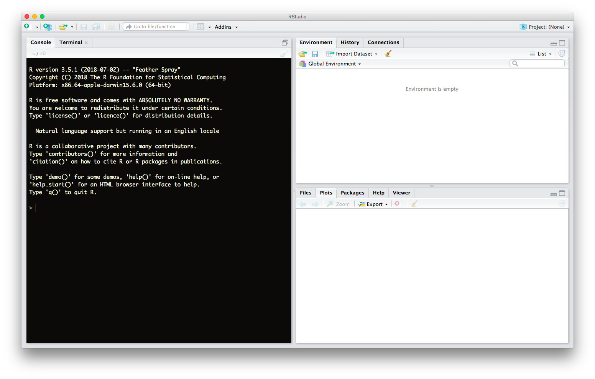

---
output:
  beamer_presentation:
    theme: Berlin
    colortheme: seagull
    fonttheme: professionalfonts
    highlight: tango
    toc: false
    includes:
      in_header: preamble.tex
---
```{r setup, include=FALSE}
knitr::opts_chunk$set(echo = TRUE)
```

\maketitle

## Outline of This Session
\tableofcontents

# General Information

## Install & Open R

- If you brought your own computer:
    - Download R from https://cran.r-project.org/ & install
    - Download RStudio from https://www.rstudio.com/ & install
- Open RStudio.

## Who am I?

- **Background**: Political scientist turned $\mathcal{R}$ enthusiast
- **Position**: Project Manager @ [Ebner Stolz](https://www.ebnerstolz.de)
- **Fields**: Autocracy, contentious politics, applied methods
- **Secret weakness**: I *enjoy* tabletop RPG podcasts.
\vfill
\begin{block}{\textbf{Introductory Round}}
  So, who are you? Fill us in on your secret weakness.
\end{block}

## Goals of this workshop

1. Provide a grand tour of elementary $\mathcal{R}$
    - Elementary data management
    - Basic (probabilistic) programming
    - Introduction to ggplot2
    - Basic statistics & applied regression
2. Introduce self-help strategies
    - Diagnose error messages
    - Find *relevant* resources
3. Reduce anxiety

## Workshop logistics

- **Place**: Campus Griebnitzsee, House 7, Room 2.41
- **Coffee break**: 10:45 - 11:00
- **Lunch break**: 12:30 - 13:30
- **Materials**: Go to https://github.com/dagtann/pcqr/

\begin{table}
  \begin{tabular}{lccll}
    \toprule
    Day & Start & End & Official Topic\\
    \midrule
    1 & 09:15 & 10:45 & The Very Basics\\
    ~ & 11:00 & 12:30 & Data Management\\
    ~ & 13:30 & 15:00 & Basic Program Flow\\
    \midrule
    2 & 09:15 & 10:45 & Graphics\\
    ~ & 11:00 & 12:30 & Basic Statistics\\
    ~ & 13:30 & 15:00 & GLMs\\
    \bottomrule
  \end{tabular}
\end{table}

# Toward $\mathcal{R}$

## Why bother with $\mathcal{R}$?

- **Popular**
    - Large community to turn to for help
    - New statistical routines often first implemented in R
- **Data wrangling**
    - Powerful tools for handling, cleaning and exploring data
- **Data vizualization**
    - Powerful, flexible, and easy plotting (unlike S....)
- **Open source**
    - Free for teachers, students, and everyone else
    - Huge & active community of developers
    - Tons and tons and tons of free material
    - Free multi-core support (unlike S....)

## Seriously, why bother with $\mathcal{R}$?

- **Jobs, Jobs, Jobs!**
    - Thousands of openings on LinkedIn \& Xing
    - Excellent entry salaries at all levels of seniority
- **Power. Overwhelming.**
    - Let's walk through appetizer.Rmd
    {width=320px}


# Making Landfall

## A First Glance at R Studio



## Let's take $\mathcal{R}$ for a ride.

Use $\mathcal{R}$ to answer the following problems.

1. $2 + 2$
2. $-3 \cdot 9$
3. $\sqrt[3]{8}$
4. $(2 + 3) \cdot 8$
5. $log(1)$
6. $\mathcal{R}$ ships with an extensive online
  documentation. For instance, it includes a manual named
  ``An Introduction to R''.[^1] Use the RStudio help pane
  to locate this manual.

[^1]: The title doesn't say "gentle". Kabacoff, Robert I. (2015). *R in Action*. Data Anaysis and Graphics With R. 2$^{nd}$ ed. Manning Publications: Shelter Island, NY, and Kosuke, Imai (2017). *Quantitative Social Science*. Cambridge Universtiy Press: Cambdridge offer most gentle introductions.

## What was that about?

1. $\mathcal{R}$ is mostly easy to talk to.
    - Hints on the terminal.
    - $>$: $\mathcal{R}$ is waiting for input.
    - $+$: Your command is incomplete.
    - Error: Something went wrong.
2. $\mathcal{R}$ is a super-charged calculator.
3. An elementary way to get help on $\mathcal{R}$ is to ask
  $\mathcal{R}$.[^2]
    a. ?\"+\" - Opens the help page on arithmetic operators.
    b. help(\"+\") - Same here.
    c. ??Regression - Conducts a keyword search for "Regression".

[^2]: Quotation marks are mandatory for operators (e.g., +) and
control flow statements (e.g., if).

# Objects

## What is an object?

- $\mathcal{R}$ stores data in objects.
- When encountering an object, $\mathcal{R}$ returns the
  data saved inside.
```{r}
a <- 1 # Assign value "1" to object "a".
a # Retrieve the value of "a".
a + 2 # Retrieve the value of "a" and add "2" to it.
a <- 999; a # On reassignment R overwrites an object.
```

## The Rules of Assignment

- Valid assignment patterns:
```{r, eval = FALSE}
a <- 3 # Object <- Value
3 -> a # Value -> Object
```
- Naming rules:
    - Rule 1: An object name cannot start with a number.
    - Rule 2: An object name cannot use certain special symbols,
      e.g., ^, !, $, @, +, -, /, [.
    - Rule 3: Capitalization matters, i.e. A $\neq$ a.

\begin{block}{What names will work?}
\begin{tabular}{llllll}
!d0 & FOO & 1\_day & day\_1 \_day1 & day.1 & day{\textasciicircum}1 \\
\end{tabular}
\end{block}

## The Rules of Assignment

- Valid assignment patterns:
```{r, eval = FALSE}
a <- 3 # Object <- Value
3 -> a # Value -> Object
```
- Naming rules:
    - Rule 1: An object name cannot start with a number.
    - Rule 2: An object name cannot use certain special symbols,
      e.g., ^, !, $, @, +, -, /, [.
    - Rule 3: Capitalization matters, i.e. A $\neq$ a.

\begin{block}{What names will work?}
\begin{tabular}{llllll}
\color{red}{!d0} & \color{blue}{FOO} & \color{red}{1\_day} & \color{blue}{day\_1}
\color{red}{\_day1} & \color{blue}{day.1} & \color{red}{day{\textasciicircum}1} \\
\end{tabular}
\end{block}

## How does $\mathcal{R}$ are operate on objects?

Execute these commands and describe the result.
```{r, eval = FALSE}
die <- 1:6
die * die
die + 1:3
die %*% die
```

> - **Lessons learned**:
> - $\mathcal{R}$ defaults to element-wise execution.
    In spreadsheet thinking, values of one record are only paired with other values of that same record.
> - If $\mathcal{R}$ operates on vectors of unequal length,
    it will repeat the shorter vector until it meets the longer
    one.[^3]
> - $\mathcal{R}$ does linear algebra when explicitly
    asked to.

[^3]: In $\mathcal{R}$ this behavior is called "recycling". Pythonistas call it "broadcasting".

# Functions

## What is a function?

- $\mathcal{R}$ uses functions to operate on data.
- The data passed to a function is called its argument.
- **Generic example:**
```{r, eval = FALSE}
FctName(arg.1 = value.1, ..., arg.n = value.n)
```
Execute these commands and describe the result.
```{r, eval = FALSE}
die <- 1:6; mean(die)
round(mean(die), digits = 2); round(mean(die), 2)
```

> - **Lessons learned**:
> - Arguments can be raw data or results of another function.
> - Functions have optional arguments with default values.
> - Using argument names is optional.

## How do you get more functions?

- Install & load new packages.[^4]
```{r, eval = FALSE}
install.packages("tidyverse")
library("tidyverse") # Load a package 2 access its fcts.
```
- Write your own function.
```{r, eval = FALSE}
FctName <- function(x, y, z = 1){ # Assign function
  ## x, y ... mandatory arguments
  ## z ... optional argument
  # Function body
  A <- x + y
  A + z ## FctName will return the last line of code
}
```

[^4]: Only load packages that you need and when you need them!

## How do I get help on a function?

- Access the function's help page.
- Sections of a help page:
  1. *Description* Summary of the function
  2. *Usage* Example of how you would type the function
  3. *Arguments* Explanation of the function's arguments
  4. *Details* In-depth description of the function
  5. *Value* What does the function return?
  6. *See Also* List of related functions in $\mathcal{R}$
  7. *Examples* Code that demonstrates the function.

Let's do that together. What does the function **sample** do?

# Summary

## What have we learned so far?

```{r, echo = FALSE}
example_object <- "object <- data"
example_function <- "FctName(arg.1 = val.1, arg.2 = val.2, ...)"
```
- $\mathcal{R}$ is an open-source programming language for
  statistical computing and graphics.
- $\mathcal{R}$ has two main components.
    1. Objects store data. They are the nouns of the
      $\mathcal{R}$ language. To assign objects we write:
      `r example_object`.
    2. Functions operate on data. They are the verbs of the
      $\mathcal{R}$ language. To call a function we write:\newline
      `r example_function`.
- $\mathcal{R}$ ships with an extensive, easily accessible
  documentation.
- Users can extend $\mathcal{R}$'s functionality by
  installing new packages or by writing their own functions.
