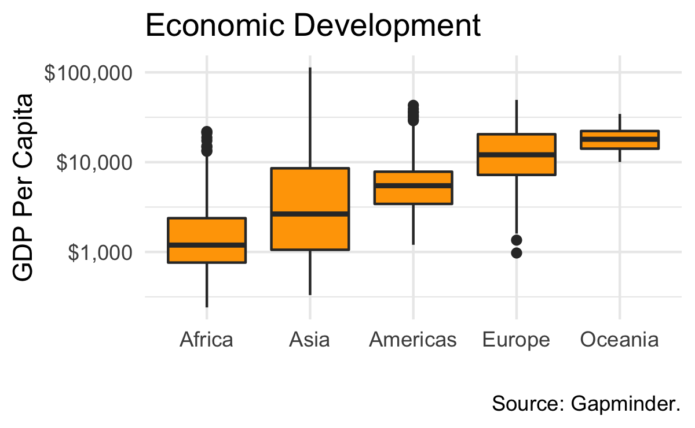

```{r}
packages <- c("tidyverse", "gapminder")
for (package in packages){
    if (!require(package, character.only = TRUE)) {
        install.packages(package, repos = "https://cloud.r-project.org")
        library(package, character.only = TRUE)
    }
}
rm(package, packages)
```

# Warmup

You should never rush blindly into data vizualization. Hence, before we get to work, we are going study our target graph in detail. Find an answer to each of
the five questions below.



1. What is your data?
```{r}
head(gapminder)
```

2. What relationships you want to see?

3. How do you want to see it?

4. What additional information do you want to see?

5. What scales, axes, labels should be swown?

# Let's build this plot together.

1. What is your data?

```{r}
p <- ggplot(data = gapminder, aes(x = ..., y = ...))
``` 

