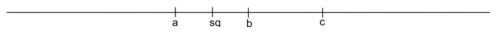
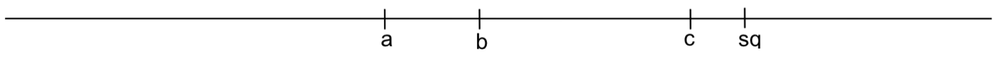

# Aufgabe A

**Nenne 2 Annahmen, die Handlungstheoretiker oft über Präferenzen treffen.**

# Aufgabe A

**Nenne 2 Annahmen, die Handlungstheoretiker oft über Präferenzen treffen.**

  > - Vollständigkeit, Transitivität (& Reflexivität)
  > - *Warum treffen sie diese Annahmen?*
  > - Konsistenz von Individualentscheidungen gewährleisten

# Aufgabe $A^*$

**Welche weitere Annahme treffen räumliche Modelle der Politik?**

# Aufgabe $A^*$

**Welche weitere Annahme treffen räumliche Modelle?**

  > - Eingipfeligkeit (Single-peakedness)
  >   - Idealpunkt: $y_i \succ o ~~ \forall ~~ o \in O\setminus\{y_i\}$
  >   - Der Nutzen einer Politik mit zunehmender Distanz vom
    Idealpunkt ab.
  >   - Es gibt eine Nutzenfunktion, mit deren Hilfe der
    Nutzenverlust dargestellt werden kann.
  > - *Warum treffen sie diese Annahme?*
  >   - Konsistenz von Kollektiventscheidungen gewährleisten
  >   - Beispiel: Condorcet's Abstimmungsparadoxon
  
# Beispiel

In einer Umfrage während des Vietnamkriegs fragten
Sidney [Verba *et al.*](https://www.cambridge.org/core/journals/american-political-science-review/article/public-opinion-and-the-war-in-vietnam/4CF464A54961820322468877568C89B0) nach den Präferenzen der amerikanischen
Bevölkerung über das weitere Engagement ihre Landes in Vietnam.

a. Verba *et al.* fanden heraus, dass die Antworten der
  meisten Befragten den Anforderungen eines eindimensionalen
  Politikraums genügten. Welche Anforderungen sind das?
b. Ein kleiner Teil der Befragten verlangte sowohl eine
  Reduktion als auch eine Erweiterung des Engagements.
  Welche Annahme verletzen diese Befragten? Worauf deutet
  der Verstoß hin?

# Aufgabe B

In einem eindimensionalen Politikraum sind die Idealpunkte der Akteure a, b und c abgetragen. Der Status Quo ist mit sq bezeichnet.

a. Zeichne die Präferenzmenge von a, b, und c ein.
b. Zeichne die Gewinnmenge für den Fall ein, dass die Mehrheitsregel gilt.
c. Jeder Akteur darf jederzeit neue Vorschläge unterbreiten. Es gilt die Mehrheitsregel. Welcher Punkt wird sich schlussendlich durchsetzen?

# Aufgabe B Die **Präferenzmenge** eines Akteurs\dots

 \dots ist die Menge aller
  Alternativen $o \in O$, die ein Akteur gegenüber einem
  Referenzpunkt $o^*$ bevorzugt:
  $Pr_i(o^*) = \{o \in O; o \succ o^*\}$.

\begin{figure}
  \includegraphics[width = .5\textwidth]{ex_praeferenzmenge.png}
\end{figure}

# Aufgabe C

In einem eindimensionalen Politikraum sind die Idealpunkte der Akteure a, b und c abgetragen. Der Status Quo ist mit sq bezeichnet. Es gilt die Mehrheitsregel. Löse die einzelnen Teilaufgaben der Zeichnung.

a. Schraffiere die Einigungsmenge der Akteure b und c.
b. Welchen Punkt würde a (c) vorsclagen, wenn er der Agendasetzer wäre und ein alleiniges Vorschlagsrecht besäße?
c. Nimm an, im Falle einer Nichteinigung würder nicht der Status quo bestehen bleiben, sondern die Regel sq$^*$ tritt in Kraft. Welche Punkt würde Agendasetzer a jetzt vorschlagen?

# Aufgabe D

Unter der Annahme vollkommener Fraktionsdisziplin lassen sich die Fraktionen a, b, und c durch ihre Medianpositionen im eindimensionalen Politikraum darstellen. Es sei sq der Status Quo. Folgende Fraktionsstärken gelten: a 33 | b 19 | c 48.

a. Begründe die Abbildung durch den Medianabgeordneten.
b. Nimm an, es würde offen nach einfacher Mehrheit abgestimmt. Wer setzt sich durch?
c. Eine Verfassungsänderung benötigt $\frac{2}{3}$ der Stimmen.
  - Zeichne die Gewinnmenge des Status Quo ein.
  - Nimm an, b sei die Agendasetzerin. Was schlägt sie vor?

# Aufgabe E

In einem zweidimensionalen Politikraum sind die Idealpunkte der Akteure a, b, und c abgetragen. Der Status Quo ist mit sq bezeichnet.

\begin{columns}
  \begin{column}{.5\textwidth}
    \includegraphics{problem_e.png}
  \end{column}
  \begin{column}{.5\textwidth}
    \begin{itemize}
      \item Wie gewichten die Akteure beide Dimensionen?
      \item Schraffiere die Gewinnmenge unter Geltung der Mehrheitsregel.
     \item Schraffiere die Gewinnmenge unter Geltung der Einstimmigkeitsregel.
    \end{itemize}
  \end{column}
\end{columns}

# Aufgabe E Die **Gewinnmenge** einer Option\dots
  - Zusammenspiel der Präferenzmengen mehrerer Akteure
  - Schnittmenge der Präferenzmengen aller Akteure: $Pr_C(sq) = \cap_{i \in C}Pr_i(sq)$
  - Ergebnis hängt von der Entscheidungsregel ab
