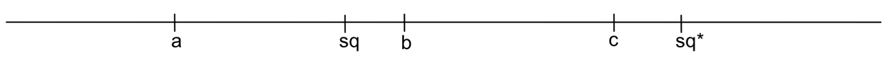

---
output:
  beamer_presentation:
    includes:
        in_header: universal_header.tex
    theme: "Berlin"
    fonttheme: "professionalfonts"
    colortheme: "seagull"
    fig_caption: false
    toc: false
---
\subtitle{Räumliche Modelle der Politik}
\date{20. Mai 2019}
\maketitle

# Aufgabe A

**Nenne 2 häufige Annahmen über individuelle Präferenzen.**

# Aufgabe A

**Nenne 2 häufige Annahmen über individuelle Präferenzen.**

  > - Vollständigkeit, Transitivität
  > - **Warum treffen wir diese Annahmen?**
  > - Konsistenz von Individualentscheidungen gewährleisten

# Aufgabe $A^*$

**Welche weitere Annahme treffen räumliche Modelle?**

# Aufgabe $A^*$

**Welche weitere Annahme treffen räumliche Modelle?**

  > - Eingipfeligkeit (Single-peakedness)
  >   - Idealpunkt: $y_i \succ o ~~ \forall ~~ o \in O\setminus\{y_i\}$
  >   - Der Nutzen nimmt mit zunehmender Distanz von $y_i$ ab.
  >   - Eine Nutzenfunktion stellt diesen Verlust dar.
  > - **Warum treffen sie diese Annahme?**
  >   - Konsistenz von Kollektiventscheidungen gewährleisten
  >   - Beispiel: Condorcet's Abstimmungsparadoxon

# Beispiel: Condorcet's Abstimmungsparadoxon
```{r, create_paradox_plot, include = FALSE}
rm(list = ls())
voter <- c("Julia", "Thimo", "Ida")
preferences <- matrix(
  c(
    3, 2, 1,
    1, 3, 2,
    2, 1, 3
  ),
  ncol = 3, byrow = TRUE, dimnames = list(voter, c(letters[1:3]))
)
pdf("~/github/teaching/ss19/grundl_vgl/condorcets_paradox.pdf", width = 5, height = 5)
par(xpd=TRUE)
plot(
  preferences, type = "n",
  xlab = "", ylab = "Nutzen",
  bty = "n", xaxt = "n", yaxt = "n"
)
axis(side = 1, at = seq(3), label = LETTERS[1:3])
for (i in seq(voter)) {
  lines(seq(length(voter)), preferences[voter[i], ], lty = i)
}
legend(x = 1, y = 3.3, legend = voter, lty = seq(length(voter)), bty = "n", horiz = TRUE)
dev.off()
```

\begin{columns}
  \begin{column}{.49\textwidth}
    \begin{table}
      \centering
      \begin{tabular}{l*{3}{c}}
        \toprule
        Präferenz & 1. & 2. & 3. \\ \midrule
        Julia & A & B & C \\
        Thimo & B & C & A \\
        Ida & C & A & B \\
        \bottomrule
      \end{tabular}
    \end{table}
    \begin{align*}
      A~vs.~B&: \text{Julia,~Ida}~vs.~\text{Thimo} \\
      B~vs.~C&: \text{Thimo,~Julia}~vs.~\text{Ida} \\
      C~vs.~A&: \text{Thimo,~Ida}~vs.~\text{Julia} \\
      \text{Zirkel}&: A \succ B \succ C \succ A
    \end{align*}
  \end{column}
  \hfill
  \begin{column}{.49\textwidth}
    \begin{figure}[t]
      \centering
      Warum kreisen die Päferenzen?
      \includegraphics[width = \textwidth]{~/github/teaching/ss19/grundl_vgl/condorcets_paradox.pdf}
    \end{figure}
    \vfill
  \end{column}
\end{columns}

# Aufgabe B

In einem eindimensionalen Politikraum sind die Idealpunkte der Akteure a, b und c abgetragen. Der Status Quo ist mit
sq bezeichnet.


a. Zeichne die Präferenzmenge von a, b, und c ggü. sq ein.
b. Zeichne die Gewinnmenge für den Fall ein, dass die Mehrheitsregel gilt.
c. Jeder Akteur darf jederzeit neue Vorschläge unterbreiten. Es gilt die Mehrheitsregel. Welcher Punkt wird sich schlussendlich durchsetzen?

# Aufgabe B Die **Präferenzmenge** eines Akteurs\dots

 \dots ist die Menge aller
  Alternativen $o \in O$, die ein Akteur gegenüber einem
  Referenzpunkt $o^*$ bevorzugt:
  $Pr_i(o^*) = \{o \in O; o \succ o^*\}$.

\begin{center}
  \includegraphics[width = .5\textwidth]{ex_praeferenzmenge.png}
\end{center}

# Aufgabe C

In einem eindimensionalen Politikraum sind die Idealpunkte der Akteure a, b und c abgetragen. Der Status Quo ist mit sq bezeichnet. Es gilt die Mehrheitsregel. Löse die einzelnen Teilaufgaben der Zeichnung.



a. Schraffiere die Gewinnmenge der Akteure b und c.
b. Welchen Punkt würde a (c) vorsclagen, wenn er der Agendasetzer wäre und ein alleiniges Vorschlagsrecht besäße?
c. Nimm an, im Falle einer Nichteinigung würder nicht der Status quo bestehen bleiben, sondern die Regel sq$^*$ tritt in Kraft. Welche Punkt würde Agendasetzer a jetzt vorschlagen?

# Aufgabe D

Unter der Annahme vollkommener Fraktionsdisziplin lassen sich die Fraktionen a, b, und c durch ihre Medianpositionen im eindimensionalen Politikraum darstellen. Es sei sq der Status Quo. Folgende Fraktionsstärken gelten: a 33 | b 19 | c 48.


a. Begründe die Abbildung durch den Medianabgeordneten.
b. Nimm an, es würde offen nach einfacher Mehrheit abgestimmt. Wer setzt sich durch?
c. Eine Verfassungsänderung benötigt $\frac{2}{3}$ der Stimmen.
  - Zeichne die Gewinnmenge des Status Quo ein.
  - Nimm an, b sei die Agendasetzerin. Was schlägt sie vor?

# Aufgabe E

In einem zweidimensionalen Politikraum sind die Idealpunkte der Akteure a, b, und c abgetragen. Der Status Quo ist mit sq bezeichnet.

\begin{columns}
  \begin{column}{.5\textwidth}
    \includegraphics{problem_e.png}
  \end{column}
  \begin{column}{.5\textwidth}
    \begin{itemize}
      \item Wie gewichten die Akteure beide Dimensionen?
      \item Schraffiere die Gewinnmenge unter Geltung der Mehrheitsregel.
     \item Schraffiere die Gewinnmenge unter Geltung der Einstimmigkeitsregel.
    \end{itemize}
  \end{column}
\end{columns}

# Aufgabe E Die **Gewinnmenge** einer Option\dots
  - Zusammenspiel der Präferenzmengen mehrerer Akteure
  - Schnittmenge der Präferenzmengen aller Akteure: $Pr_C(sq) = \cap_{i \in C}Pr_i(sq)$
  - Ergebnis hängt von der Entscheidungsregel ab
