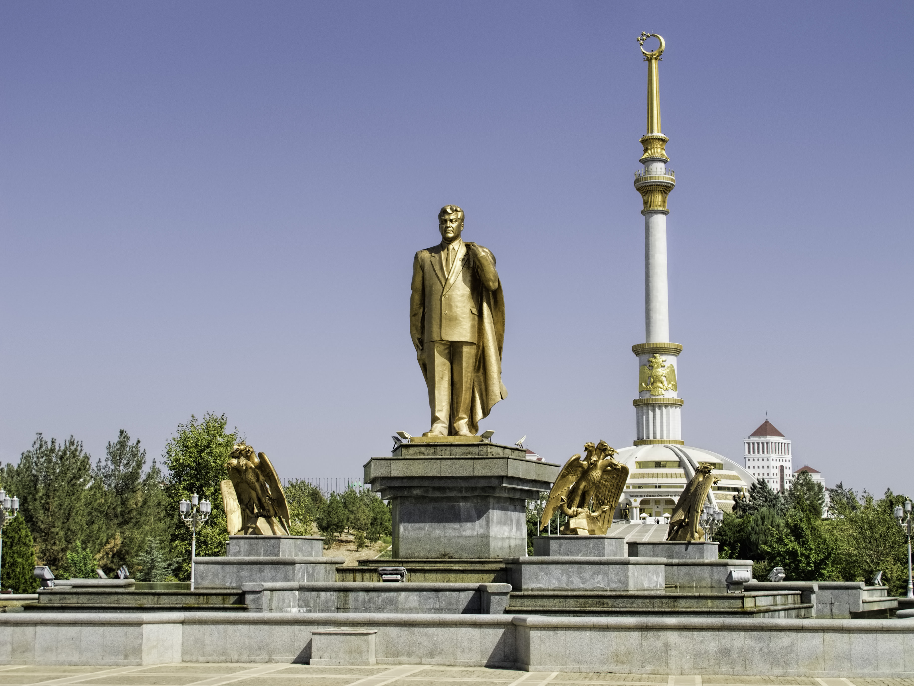
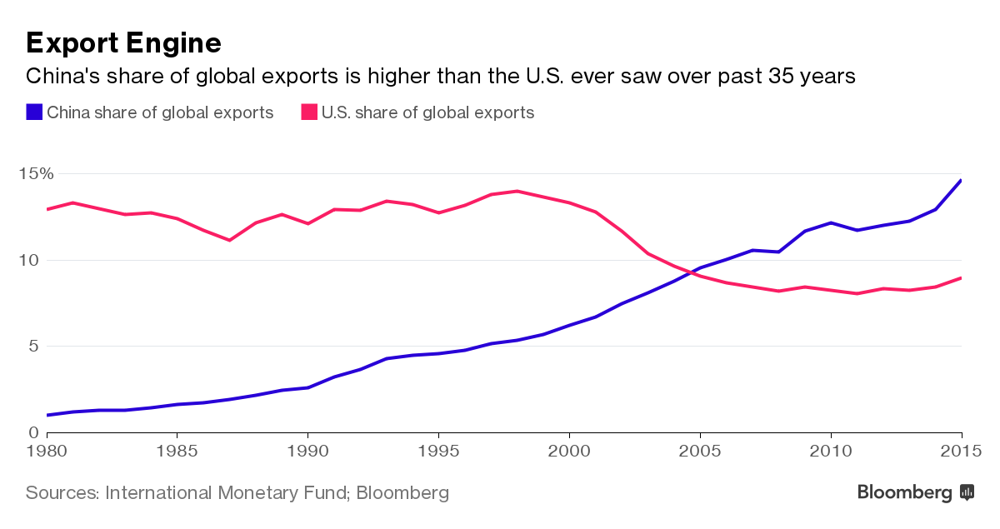

```{r setup, include=FALSE}
knitr::opts_chunk$set(echo = FALSE)
```

# Warum über Autokratien sprechen?

## Skuriles

**Saparmyrat Ataýewiç Nyýazow**, auch
Turkmenbaschi, war bis 2006 Staats-
und Regierungschef Turkmenistans. Er betrieb
einen exzessiven Personenkult und stiftete u.a. eine goldene
Statue, die sich innerhalb eines Tages einmal um die eigene
Achse dreht.

<div class="centered">
  
</div>

## Verbreitung

```{r Verbreitung, echo = FALSE}
library("foreign")
gwf <- read.dta("/Users/dag/github/teaching/ws1617/introAtr/01/data/GWF_AllPoliticalRegimes.dta")
gwf <- within(gwf, {
  regime_type <- ifelse(
    gwf_regimetype != "NA", 1,
    ifelse(gwf_nonautocracy == "democracy", 0, NA)
  )
  regime_type <- factor(regime_type, 0:1, c('Autokratie', 'Demokratie'))
  }
)

library('ggplot2')
ggplot(
  data = subset(gwf, !is.na(regime_type)),
  aes(x = year)
) +
  geom_bar(width = 1, colour = 'gray85', size = .1) + facet_wrap(~ regime_type) +
  scale_x_continuous(breaks = seq(1950, 2010, 10)) +
  labs(
    y = "Anzahl unabhängiger Staaten",
    title = "Geddes, Wright, Frantz (2014)"
  ) +
  theme_minimal() +
  theme(axis.title.x = element_blank())
```

## Geopolitische Bedeutung

<div class="centered">
  
</div>

Quelle: [Bloomberg.com (17.10.2016)](http://www.bloomberg.com/news/articles/2016-09-06/china-export-machine-defying-gravity-grabs-global-market-share)

# Aufbau und Teilnahmebedingungen

## Leitfragen

1. Was ist Autokratie(-forschung)?
    - Polit. Ordnung als emp.-analyt. Problem verstehen
2. Wie erkenne, nenne und erkläre ich eine Autokratie?
    - Definitionen, Typologien, Prämissen
3. Was suchen demokratische Institutionen in der Autokratie?
    - Wahlen, Parteien, Parlamente
4. Welche Herausforderungen stellen sich der Autokratie?
    - Proteste, Repression, Wohlfahrt, etc.
    
## Teilnahmebedingungen

1. Regelmäßige, aktive Teilnahme
2. Kurzzusammenfassung von max. 250 Wörtern (**alle**)
3. Ergebnisprotokoll (**5/6 LP**)
4. Hausarbeit (**9/10 LP**)

Es gelten die näheren Bestimmungen des Syllabus.

## Sonstiges

- **Moodle** Autokratie (Pflichtlektüre, Zusammenfassungen)
- **Passwort** TickTack2016
- **Sprechstunde** Dienstag, 12 - 13 Uhr, R 1.44
