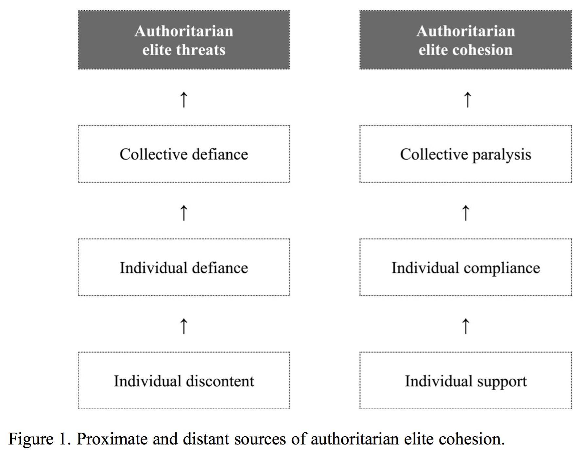

## Motivation und Forschungsfrage

- Autokratien scheitern häufig über Konflikte zw. Eliten
- Nachfolgeprozesse besonders riskant

\begin{quote}
  "If elite divisions represent the primary threat to the
  political survival of dictators, its opposite, elite
  cohesion, represents their best guarantee of continuity
  in power." (95)
\end{quote}

**Forschungsfrage** Wie wird der Kohäsion gewährleistet?

## Die kommunikativen Imperative der Autokratie

**Problem** Strukturelle Intransparenz der Autokratie

\begin{quote}
  "Their suppresive nature inhibits the public expression of
  political dissidence, and their secretive nature blocks
  the public scrutiny of political decision-making." (93)
\end{quote}

**Herausforderung** Fundamente der Macht hervorheben

**Mittel** Diktatorische Macht öffentlich inszenieren

## Das Fundament diktatorischer Macht

**Unsichtbare Quellen der Elitenkohäsion**

1. Einstellungen: Utilitaristische, affektive & kognitive Anreize
2. Indiv. Verhalten: Unterstützung fordern, Abweichung bestrafen
3. Kollektive Handlungsunfähigkeit: Organisation verhindern

## Pfaddiagram, p. 96

## Von der Theorie zur Praxis

**Performative Kommunikation der Elitenkohäsion**

1. Communication of *normalcy*: Es gibt gar kein Problem.
2. Communicating *compliance*: Alle hängen mit drin.
3. Communicating *sovereignty*: Wir fackeln nicht lange.
4. Communicating *uniformity*: Wir sind aus einem Holz.
5. Communicating *disorganization*: Wir wissen Bescheid.
